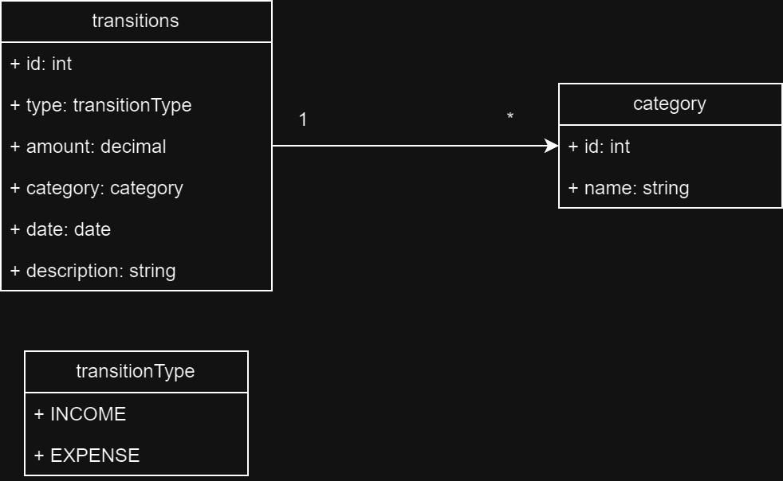

# Personal Finance Tracker Backend

This is the backend for the Personal Finance Tracker application. It provides a RESTful API for managing and tracking financial transactions. The backend is built using Spring Boot, with PostgreSQL as the database, hosted on Railway.

## Getting Started

Follow these instructions to set up and run the application on your local machine.

### Prerequisites

- **Java 17**: Ensure you have Java 17 installed. 
- **Maven**: Make sure Maven is installed. 
- **PostgreSQL**: Ensure you have access to a PostgreSQL instance. If you're using the Railway-hosted database, ensure your connection details are correct.

### Installation

1. **Clone the repository**:
   ```bash
   git clone https://github.com/GregoryG8/finance-tracker-backend

2. **Navigate to the project directory**:
   ```bash
   cd finance-tracker-backend

### API Endpoints
The application provides the following API endpoints:

- **POST /transactions**: Create a new financial transaction.
- **GET /transactions**: Retrieve all financial transactions.
- **GET /transactions/{id}**: Retrieve a transaction by ID.
- **PUT /transactions/{id}**: Update an existing transaction.
- **DELETE /transactions/{id}**: Delete a transaction.

Bonus Features:

- **GET /transactions/summary**: Retrieve a summary of financial data.
- **GET /transactions/by-category**: Retrieve transactions filtered by category.
- **GET /transactions/by-date**: Retrieve transactions within a specific date range.
- **GET /categories**: Retrieve all available categories.

### API Documentation
Detailed API documentation, including example requests and responses, can be found on Postman: [API Documentation](https://documenter.getpostman.com/view/31592068/2sAXjDfbio).

### Database Schema
The database schema includes the following key entity:

- Transaction:
- ID (Primary Key, Auto Increment)
- Type (Enum: Income, Expense)
- Amount (Decimal, Required)
- Category (String, e.g., Groceries, Salary, Rent)
- Date (Date)
- Description (Text, Optional)

